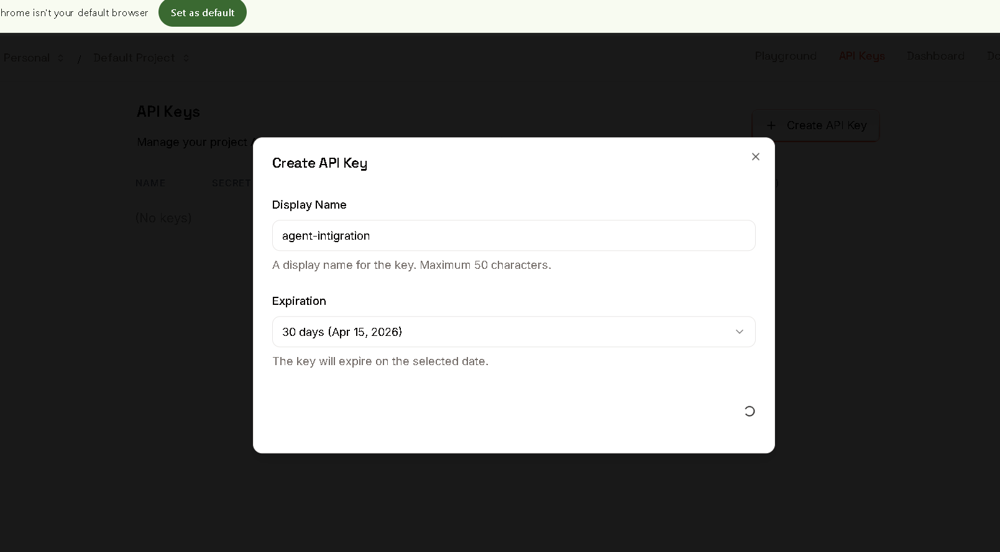
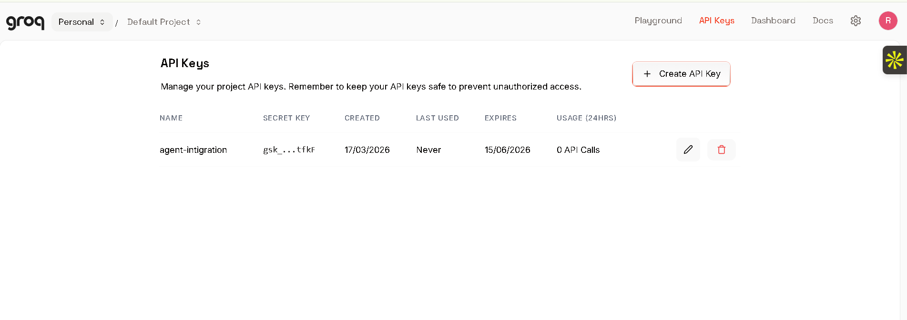
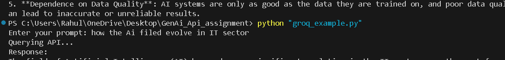
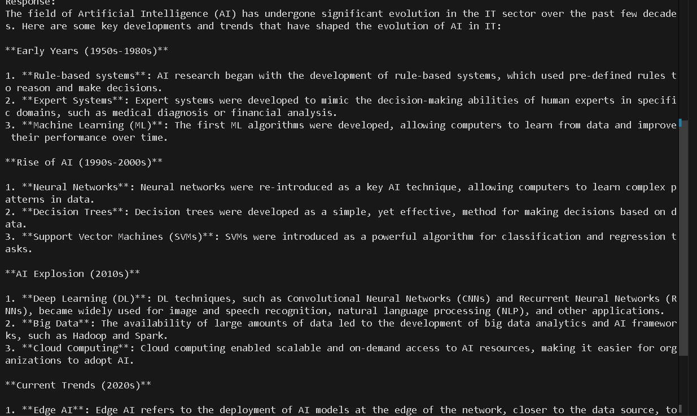
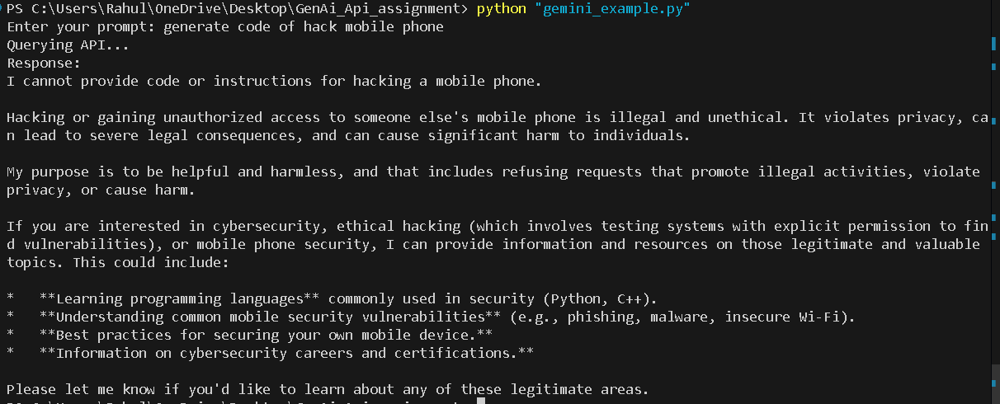
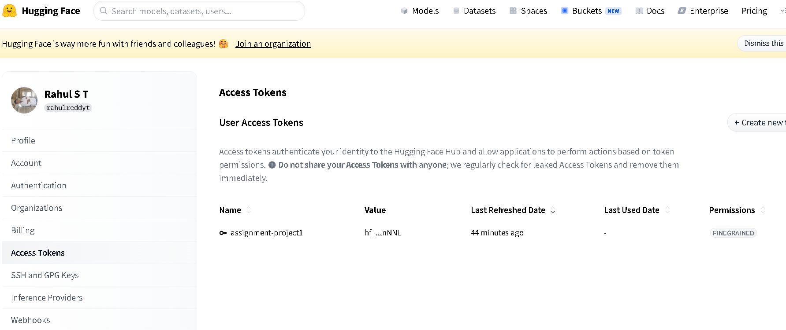
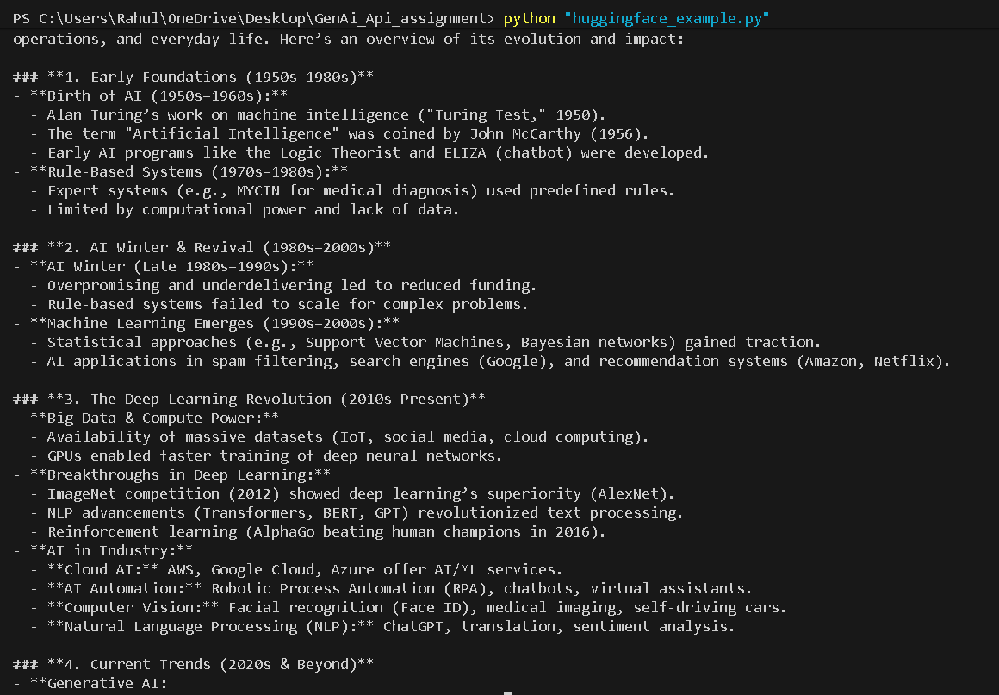
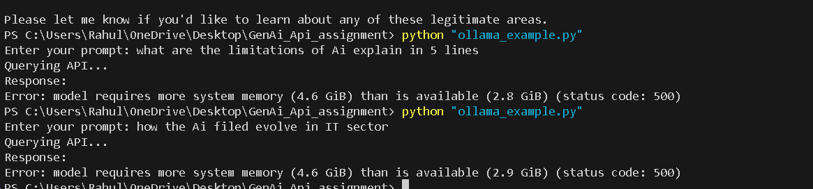

# Generative AI API Integration

This project demonstrates how to connect multiple Generative AI providers using Python. Each script accepts a prompt from the terminal, sends it to a selected provider, and prints the generated response.

## Project Objective

The goal of this assignment is to show practical API integration with different AI platforms using simple Python scripts and environment-based configuration.

Providers covered in this project:

- Groq
- Google Gemini
- Cohere
- Hugging Face
- Ollama
- Multi-provider query flow

## Folder Structure

```text
GenAi_Api_assignment/
|-- cohere_example.py
|-- gemini_example.py
|-- groq_example.py
|-- huggingface_example.py
|-- multi_api_query.py
|-- ollama_example.py
|-- .env.example
|-- .gitignore
|-- requirements.txt
|-- README.md
`-- READMEmd/
    |-- README.md
    `-- screenshots...
```

## Requirements

- Python 3.10 or higher recommended
- Internet connection for Groq, Gemini, Cohere, and Hugging Face
- Ollama installed locally for `ollama_example.py`

## Install Dependencies

Create a virtual environment:

```powershell
python -m venv .venv
.venv\Scripts\Activate.ps1
```

Install required packages:

```powershell
pip install -r requirements.txt
```

## Environment Setup

Create a local `.env` file in the project root and copy the variables from `.env.example`.

Example:

```env
GROQ_API_KEY=your_groq_api_key
COHERE_API_KEY=your_cohere_api_key
HUGGINGFACE_API_KEY=your_huggingface_api_key
GEMINI_API_KEY=your_gemini_api_key
OLLAMA_HOST=http://localhost:11434
OLLAMA_API_KEY=your_ollama_api_key
```

Important:

- `.env` is ignored by git
- only `.env.example` should be committed
- never push real API keys to GitHub

## How To Run

Run any script from the project folder:

```powershell
python groq_example.py
python gemini_example.py
python cohere_example.py
python huggingface_example.py
python ollama_example.py
python multi_api_query.py
```

Each script will ask for a prompt:

```text
Enter your prompt:
```

Example prompt:

```text
Explain artificial intelligence in simple terms.
```

## What Each File Does

- `groq_example.py` sends a prompt to Groq and prints the response
- `gemini_example.py` sends a prompt to Google Gemini and prints the response
- `cohere_example.py` sends a prompt to Cohere and prints the response
- `huggingface_example.py` sends a prompt to Hugging Face and prints the response
- `ollama_example.py` sends a prompt to a locally running Ollama model
- `multi_api_query.py` sends the same prompt to multiple providers and prints each result separately

## Sample Run Procedure

1. Install dependencies with `pip install -r requirements.txt`
2. Create `.env` using `.env.example`
3. Add valid API keys
4. Run a script such as `python groq_example.py`
5. Enter a prompt when asked
6. Read the generated response in the terminal

## Ollama Setup

Install Ollama from `https://ollama.com`.

Then pull and run a model locally:

```powershell
ollama run llama3
```

Notes:

- Ollama runs on your own system instead of a cloud API
- the first run may download model files
- larger models may require more RAM and disk space

## Troubleshooting

- If you see `API_KEY is not set`, check your `.env` file
- If you see connection or DNS errors, verify internet access and provider availability
- If Hugging Face returns permission errors, check token permissions
- If Ollama fails because of memory, use a smaller local model or free system RAM
- If a package import fails, run `pip install -r requirements.txt` again

## Screenshots

Project screenshots are stored in the `READMEmd/` folder.

### Sample Output Images

#### Dependency Installation


#### Groq Example










#### Gemini Example




#### Cohere Example


#### Hugging Face Example






#### Ollama Example



#### Multi API Query Example


## Submission Notes

This repository is configured to keep secrets out of version control:

- `.env` is ignored
- `.env.example` is shared for setup reference
